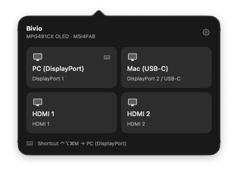
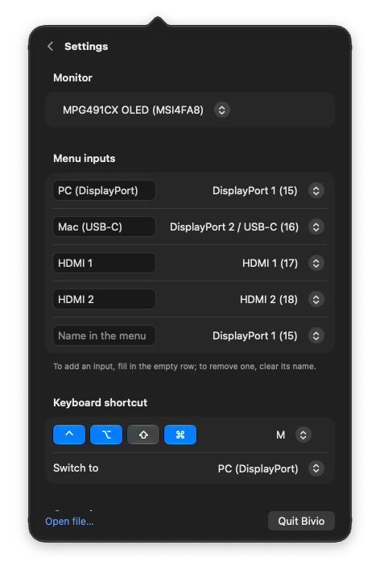
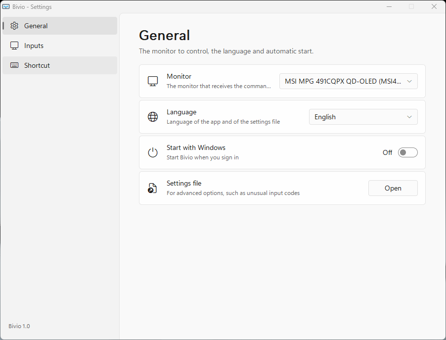
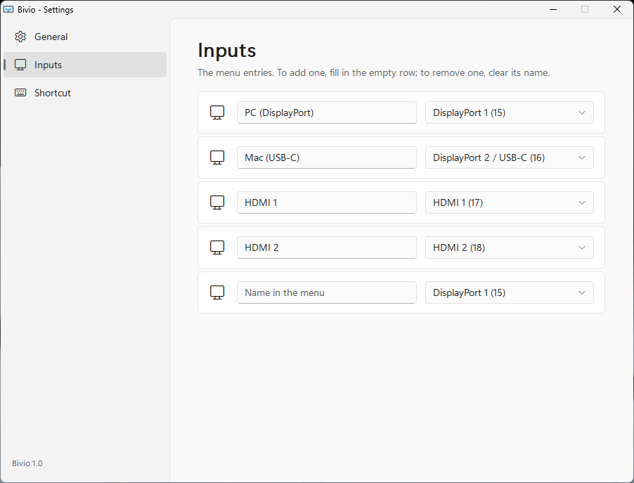
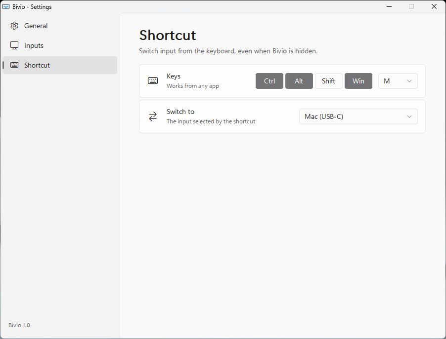
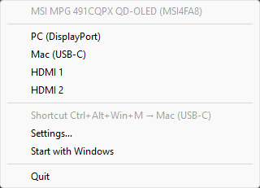

<p align="center">
  
</p>

<h1 align="center">Bivio</h1>

<p align="center">
  <strong>Tiny native input switcher for a monitor shared by several computers:<br>
  one click or one shortcut instead of the monitor's joystick.</strong>
</p>

<p align="center">
  <a href="https://www.swift.org/"></a>
  <a href="https://en.cppreference.com/w/c"></a>
  <a href="https://www.apple.com/macos/"></a>
  <a href="https://www.microsoft.com/windows"></a>
  
  <a href="https://github.com/fabioscarparo/Bivio/releases/latest"></a>
  <a href="LICENSE"></a>
</p>


Bivio is a small native app for switching a shared monitor between computers without reaching for the joystick under the screen. Its name is Italian for a fork in the road: the point where you choose which way to go, or here, which computer gets the screen.

Each computer runs its own copy of Bivio: a menu bar app on macOS or a notification-area app on Windows. From there, you can select an input or use a global keyboard shortcut to send the monitor the corresponding **DDC/CI** command.

It works with two Macs, two Windows PCs, or any combination of the two, as long as they are connected to different inputs of a monitor that supports DDC/CI.

The important part is that the command works even while the monitor is showing another computer, so any of them can switch the monitor back to itself at any time. If the monitor also has a built-in **KVM**, keyboard and mouse follow the selected input, and the same shortcut moves the whole workspace from one computer to another.

Both versions are deliberately small and self-contained: **Swift** on macOS, **C and Win32** on Windows. No helper daemon or driver, no network access and no additional runtime.

---

## Download

Get the latest version from the [Releases page](https://github.com/fabioscarparo/Bivio/releases/latest):

| Platform | File | Requirements |
|---|---|---|
| macOS | `Bivio-<version>-macOS-arm64.zip` | Apple Silicon, macOS 14 or later |
| Windows | `Bivio-<version>-Windows-x64.exe` | Windows 10 or 11, x64 |

**macOS**: unzip and move `Bivio.app` to the Applications folder. The app is not notarized by Apple, so the first launch is blocked: open **System Settings › Privacy & Security** and choose **Open Anyway** next to the message about Bivio. Alternatively, from Terminal:

```bash
xattr -dr com.apple.quarantine /Applications/Bivio.app
```

**Windows**: put the executable in a folder of your choice and run it; there is nothing to install. The executable is not signed, so SmartScreen may stop it the first time: choose **More info › Run anyway**.

Then turn on **Launch at login** (macOS) or **Start with Windows** in the settings, so Bivio is always ready.

---

## Features

Bivio keeps the interface intentionally simple:

- **macOS**: clicking the menu bar icon opens a popover with the monitor that will receive the command and the configured inputs as tiles, with names such as *Desktop*, *Work laptop* or *Console*. Right-clicking shows a quick menu.
- **Windows**: the notification-area icon opens a menu with the same inputs.

The **global shortcut** is particularly useful when switching between two computers. The defaults use the same physical keys on a shared keyboard:

- **macOS**: `⌃⌥⌘M`
- **Windows**: `Ctrl+Alt+Win+M`

The **settings** follow the native style of each platform and apply as soon as they change:

- **macOS**: a page inside the same popover, behind the gear button, with Liquid Glass controls on macOS 26.
- **Windows**: a Windows 11 settings window, with a navigation pane, setting cards, Mica title bar, system accent colour, and light and dark themes.

Other features include:

- **Start at login** on both systems.
- **English and Italian**, following the system language or chosen in the settings.
- **Command-line control** for scripts, Shortcuts, Stream Deck and other automation.
- **Custom input names and codes**, so the menu matches the way the monitor is actually used.

### At a glance

| | macOS | Windows |
|---|---|---|
| Architecture | Apple Silicon | x64 |
| Minimum version | macOS 14 | Windows 10 or 11 |
| Language | Swift (AppKit, SwiftUI) | C (Win32, GDI) |
| DDC/CI through | `IOAVService` | Monitor Configuration API (`dxva2`) |
| Runtime dependencies | None | None |
| Size | ~580 KB | ~110 KB |

---

## Screenshots

### macOS

<table>
  <tr>
    <td align="center" valign="top" width="50%">
      
      <br><sub>Inputs</sub>
    </td>
    <td align="center" valign="top" width="50%">
      
      <br><sub>Settings</sub>
    </td>
  </tr>
</table>

### Windows

<table>
  <tr>
    <td align="center" valign="top" width="50%">
      
      <br><sub>General</sub>
    </td>
    <td align="center" valign="top" width="50%">
      
      <br><sub>Inputs</sub>
    </td>
  </tr>
  <tr>
    <td align="center" valign="top" width="50%">
      
      <br><sub>Shortcut</sub>
    </td>
    <td align="center" valign="top" width="50%">
      
      <br><sub>Notification-area menu</sub>
    </td>
  </tr>
</table>

---

## How it works

### Talking to the monitor

Monitors that support **DDC/CI** accept commands over the same cable that carries the picture. Among other things, DDC/CI allows software to change the active input without going through the monitor's on-screen menu.

Bivio uses the MCCS feature **`0x60` (Input Source)**. It writes the code corresponding to the desired input, and the monitor switches as if that input had been selected from its own menu.

The codes are standardised by MCCS and normally listed in the monitor's **capability string**. The most common values are:

| Input | Code |
|---|---|
| DisplayPort | `15` (`0x0F`) |
| USB-C (DisplayPort 2) | `16` (`0x10`) |
| HDMI 1 | `17` (`0x11`) |
| HDMI 2 | `18` (`0x12`) |

On the MSI MPG 491CQPX, where Bivio was developed and tested, they appear in the firmware as `60(11 12 0F 10)`.

### On macOS

On Apple Silicon, external displays can be reached through **`IOAVService`**, Apple's private IOKit interface also used by tools such as `m1ddc` and MonitorControl.

Bivio walks the IORegistry, finds each external display and pairs its EDID attributes — manufacturer, product code and name — with the corresponding `DCPAVServiceProxy`. It then sends the DDC/CI packet over I²C.

The global shortcut uses Carbon's `RegisterEventHotKey`, which requires **no Accessibility permission**.

### On Windows

Windows exposes DDC/CI through the **Monitor Configuration API**. Bivio uses `SetVCPFeature` on the physical monitor associated with each display.

The monitor is identified by the PnP ID in its device path: the MSI MPG 491CQPX, for example, identifies as `MSI4FA8`. This lets Bivio target the intended monitor without sending commands to other displays connected to the same PC.

The settings window is drawn directly with GDI rather than shipping the WinUI runtime: the navigation pane and setting cards, the Windows 11 controls, rounded shapes, accent colours and light and dark themes are all rendered by the application itself, scaled to the system DPI.

### Switching from another computer

When the monitor switches to another input, both macOS and Windows normally keep the display connected, so the computer that is no longer visible can still send DDC/CI commands. This is what makes the shortcut work in both directions, regardless of which computer is currently on screen.

For keyboard and mouse to follow, plug them into the monitor's KVM and set each input's USB upstream connection in the monitor's menu.

---

## Settings

The settings cover the main configuration:

- Monitor selection
- Input names and codes
- Global shortcut and its target
- Language
- Start at login

Behind them is a plain, self-documenting **INI file**, which can be opened directly for options the interface doesn't expose, such as unusual input codes: **Open file…** at the bottom of the settings on macOS, **Settings file** in the General page on Windows. Opening it closes the settings, so they don't overwrite what you write in the file.

| macOS | Windows |
|---|---|
| `~/Library/Application Support/Bivio/Bivio.ini` | `%APPDATA%\Bivio\Bivio.ini` |

The available settings are:

| Section | Setting | Description | Example |
|---|---|---|---|
| `[general]` | `language` | `auto` (system language), `it` or `en` | `language=en` |
| `[monitor]` | `match` | Monitor ID, part of its name, or empty for all monitors | `match=MSI4FA8` |
| `[inputs]` | *one line per input* | Name shown in the menu and input code | `Desktop=15` |
| `[hotkey]` | `keys` | Modifiers `ctrl`, `alt`, `shift`, `cmd`/`win`, plus `A`–`Z`, `0`–`9` or `F1`–`F12`; empty disables it | `keys=ctrl+alt+cmd+m` |
| `[hotkey]` | `target` | Input code selected by the shortcut | `target=15` |

For example:

```ini
[general]
language=en

[monitor]
match=MSI4FA8

[inputs]
Desktop=15
Work laptop=16
Console=17

[hotkey]
keys=ctrl+alt+cmd+m
target=15
```

Comments start with `;` and must be on their own line. In input names, `=` is replaced with `-`, and a leading `;`, `#` or `[` is dropped: they would break the line. If the file is deleted, Bivio recreates it with the defaults on the next launch. When the explanations change with an update, or the language changes, the file is rewritten keeping its values, and the previous version is saved as `Bivio.ini.bak`.

---

## Command line

Bivio can also be controlled without opening its interface.

On macOS, `--list` shows the external monitors and their IDs:

```bash
Bivio.app/Contents/MacOS/Bivio --list
```

An input can then be selected directly:

```bash
Bivio.app/Contents/MacOS/Bivio --input 15
```

`--vcp` writes any VCP feature, which is useful for testing or automation. Here it sets the brightness:

```bash
Bivio.app/Contents/MacOS/Bivio --vcp 0x10 70
```

On Windows, `--list` shows in a message box the monitors the app sees, whether they match the settings and the input they report; `--input` switches:

```bash
Bivio.exe --list
Bivio.exe --input 16
```

The Windows executable returns exit code `0` when the command was sent, so it can be used from scripts and external automation.

---

## Building

Both applications are built from a Mac.

```bash
make mac
make win
make preview
make icons
```

- `make mac` builds `build/Bivio.app` with the Xcode command line tools.
- `make win` builds `build/Bivio.exe` with MinGW, installed with `brew install mingw-w64`.
- `make preview` renders the macOS popover pages to `build/popover-*.png`.
- `make icons` regenerates `mac/AppIcon.icns` and `win/bivio.ico` from the SVGs in `assets/`.

The macOS app is ad-hoc signed: move it to `/Applications` before enabling start at login. The Windows executable is unsigned, so SmartScreen may ask for confirmation the first time it runs.

---

## Project structure

The two applications share the same configuration format and behaviour, but each uses the native APIs of its platform.

```text
assets/
  icon.svg              the Bivio icon, used here and for Windows
  icon-macos.svg        the same icon on a light tile, for the macOS app
  screenshots/          the images of this README

mac/
  main.swift            menu bar app, global shortcut, command line
  DDC.swift             IORegistry walk, IOAVService I²C writes, monitor matching
  Config.swift          self-documenting INI settings and shortcut parsing
  Popover.swift         SwiftUI popover: input tiles and settings, Liquid Glass on macOS 26
  Strings.swift         Italian and English interface strings
  Bridge.h              declarations of the private IOAVService API
  Info.plist            menu-bar-only app bundle
  AppIcon.icns          generated by make icons

win/
  bivio.c               tray icon and menu, global shortcut, INI settings, DDC/CI
  settings.c            Windows 11 settings window drawn with GDI
  app.h                 declarations shared by the two
  bivio.rc              icon, manifest and version resources
  bivio.manifest        common controls, DPI awareness, Windows 10/11
  bivio.ico             generated by make icons

tools/
  make_icons/           renders the macOS and Windows icons from the SVGs
  render_settings/      renders the macOS popover pages to PNG
```

---

## Known limits

### macOS

The current implementation supports Apple Silicon only, with the monitor connected through USB-C or DisplayPort. The built-in HDMI port of base M1 and M2 Macs does not carry DDC.

DDC reads don't work reliably on every monitor — they don't on the MSI MPG 491CQPX — so Bivio doesn't try to determine which input is currently active: it only sends the requested switch.

### Windows

If Windows disconnects a monitor after it switches to another input, the PC can no longer reach it and Bivio reports *Display not found*. This doesn't happen with the MSI MPG 491CQPX, but behaviour may vary with other monitors and drivers.

---

## Note

Bivio is a **personal project currently in development**.

It is **not affiliated with, endorsed by, or developed by Micro-Star International (MSI)**. Monitor names are used only to describe compatibility and the hardware used during development.
